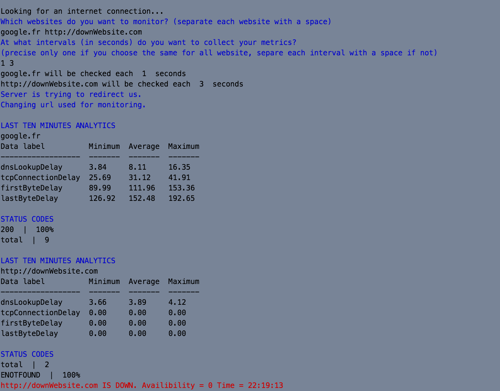
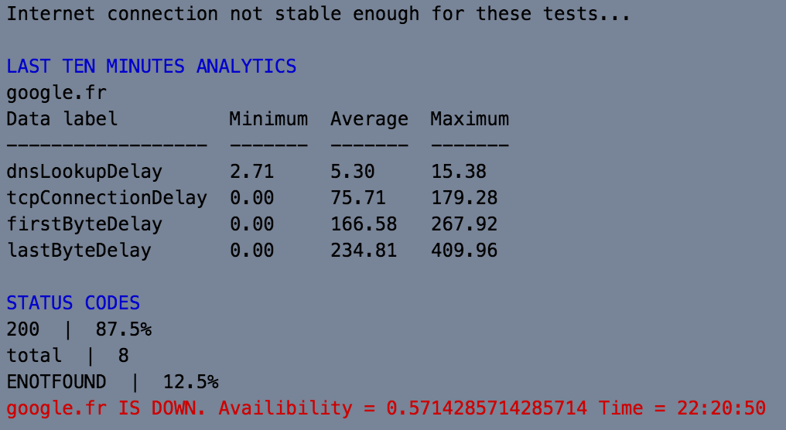

Website performance monitoring tool
==

This website performance monitoring CLI tool enables multiple websites monitoring with different check intervals. Domain names or complete urls can be used.

### Prerequisities
This program is written in javascript and will run using NodeJS. Please make sure npm and NodeJS are installed on your device.
However, it is recommended to update NodeJS first.
<pre>npm install -g n</pre>

### Installing
Simply run this command in a console interpreter to install all dependencies
<pre>npm install</pre>

### Test
Running npm install will also install mocha. You can implement new tests or run already existing tests using
<pre>npm test</pre>

### Running

To start using this CLI tool, you just have to run
<pre>npm start</pre>

### Internet connection exceptions
When internet connection is lost, user is asked to reconnect his internet connection to keep on monitoring websites.

